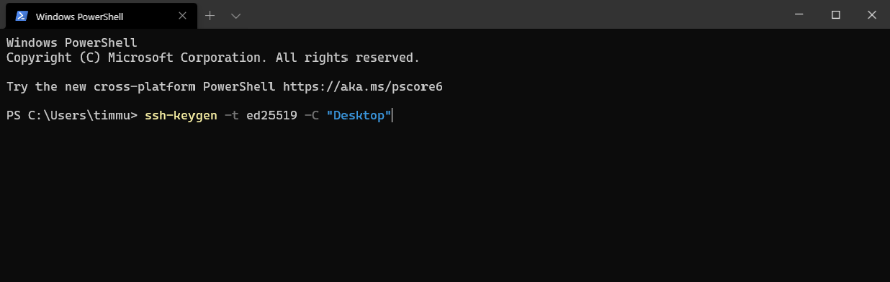
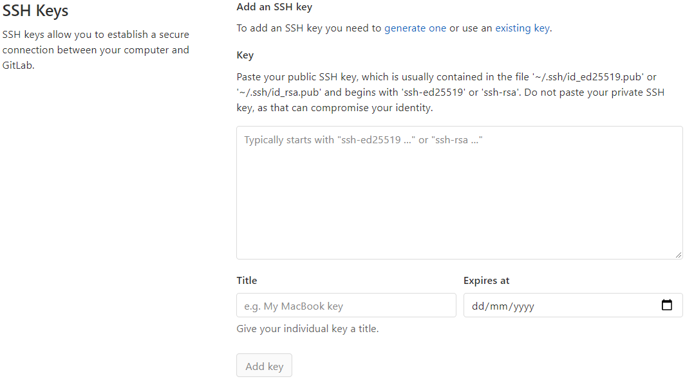
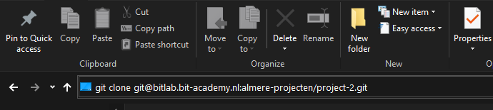

# CV Generator
## Development Environment
**Generate a SSH key to access the repository.**
```bash
ssh-keygen -t ed25519 -C "<device name>"
```





**Navigate to your local directory where the .ssh is located.**
**Then copy your public key and submit it to BitLab**





**After entering the SSH key, you can browse to a local folder to clone the repository in.**
```bash
git clone git@bitlab.bit-academy.nl:almere-projecten/project-2.git
```





**Thats it!**
## JarvisAPI
```bash
No documentation available yet.
```
## License
[MIT](https://choosealicense.com/licenses/mit/)